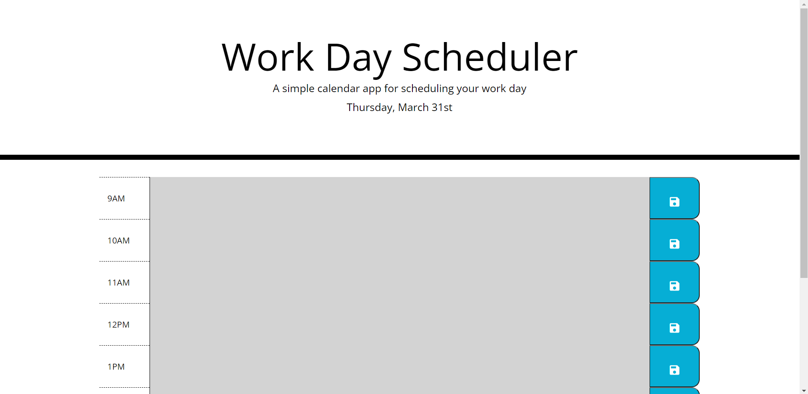

# daily-planner
This application is linked with bootstrap, moment.js, jquery ui, fontawesome, google fonts & google icons to allow the application to work. 

As soon as the user opens the application they are met with a jumbotron which was added to the html using bootstrap that displays the name of the application, what the application is expected to be used for, and they current day of the week, what month it is, and the current date. The current date is being displayed with functions associated with moment.js.

The user is able to then see nine rows with each row displaying an hour of the day ranging from 9am to 5pm. Depending on the current time, the user is able to see which hours have already passed, what the current hour is, and upcoming hours. A grey background indicates the hours that have already past, a red background indicates the current hour, and a green background indicates hours in the future. 

The user has the option to enter any text they would like into any of the given text areas. If the user would like to save their input they MUST click the save button to the right of whichever text area they just added information to, if the user does not click the save button and refreshes the page, their input will not be displayed. 

Click [here] (https://nicoled1999.github.io/daily-planner/) to view my website.